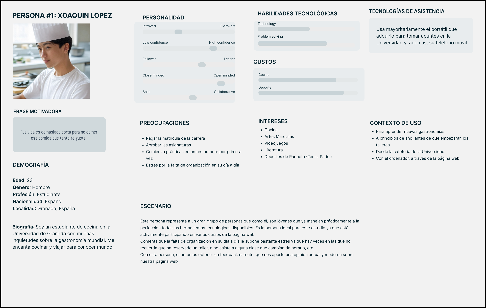
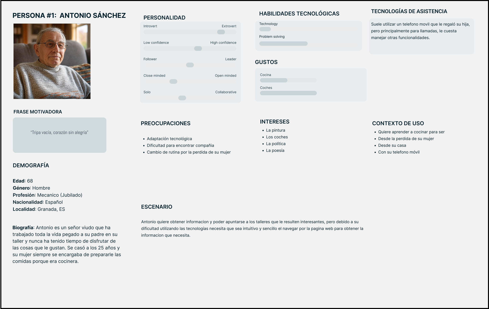
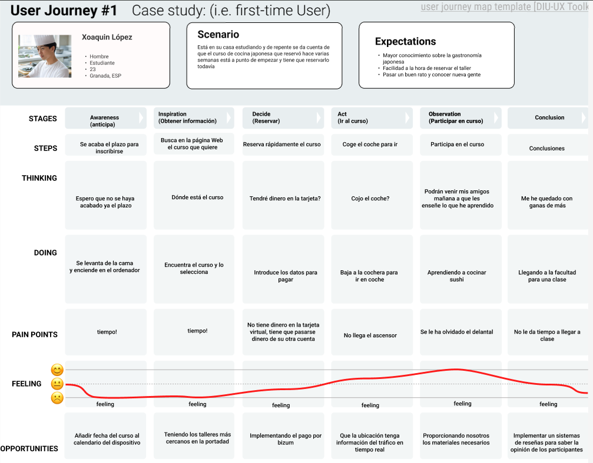
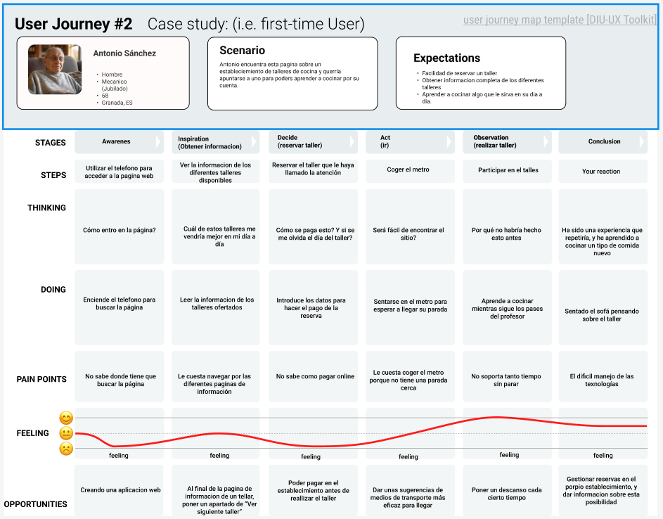

## DIU - Practica1, entregables

- Desk research: Análisis Competencia 

Partiendo de una experiencia nula en este campo, y habiendo investigado en diferentes artículos relacionados al tema, podríamos abordar la investigación mediante entrevistas a diferentes personas que podría estar interesadas en acudir al establecimiento para poder comprender por qué los usuarios hacen lo que hacen, mediante las cuales podríamos obtener información de cuáles son las necesidades y preferencias de los usuarios, para poder poner en práctica algunas de estas y encontrar posibles fallos o dificultades en el diseño con el fin de conseguir una experiencia más sencilla para el usuario. También podríamos hacer una prueba con un número reducido de usuarios sobre un diseño, para estudiar las preferencias y la facilidad de uso de los usuarios, con el fin de hacer un diseño más simple y eficaz. 

Una vez rediseñado el modelo con los datos obtenidos en el estudio, volveríamos a hacer una prueba del diseño con otro grupo de usuarios para matizar los fallos y dificultades que puedan persistir.

- Gestion de usuarios
- Información sobre la ubicación
- Soporte y asistencia
- Calendario de eventos
- Precios

Hemos escogido la gestión de usuarios como característica a evaluar, porque consideramos importante que el usuario pueda tener la comodidad de poder gestionar las reservas de manera sencilla.

- 2 Personas 

 
-----
Xoaquin López es un estudiante de Cocina en la Universidad de Granada que activamente participa en cursos que proporciona nuestra página web. Es un modelo ideal para que nos aporte una versión moderna y actualizada sobre la página web.

Antonio Sánchez es un señor de 68 viudo que quiere aprender a cocinar para poder ser más autosificiente después de la perdida de su mujer.

- 2 User Journey Map  ( 1 por persona)

En este Journey Map, Xoaquin reserva al límite uno de los cursos de la web y además al llegar se da cuenta de que se ha olvidado parte del material necesario.

En este Journey Map se representan las dificultades que puede tener una persona de edad avanzada para utilizar la tecnologia con el fin de hacer una reserva.

- Revisión de Usabilidad 

#### Briefing
Tras un estudio sobre la página web “GranadaCooking.com”, hemos detectado que es una página muy completa, con multitud de opciones que facilitan la experiencia del usuario. Entre estas opciones destacan el sistema de reservas y el calendario interactivo, que informa a los usuarios sobre los talleres más próximos. Además, cuenta con un sistema de preguntas frecuentes (FAQ) para resolver dudas sobre el funcionamiento del sitio y proporciona información precisa sobre la ubicación del lugar en la parte inferior de la página.
En cuanto a la navegación, es bastante intuitiva, ya que en todo momento indica en qué submenú te encuentras y dispone de una interfaz clara que permite a todo tipo de usuarios manejarse correctamente.
Sin embargo, el sistema de búsqueda no es muy intuitivo y podría mejorarse para ofrecer una mejor experiencia de navegación. También sería beneficioso implementar un sistema de retroalimentación (feedback) donde los usuarios que han realizado alguno de los cursos puedan dar su opinión y sugerir mejoras.
