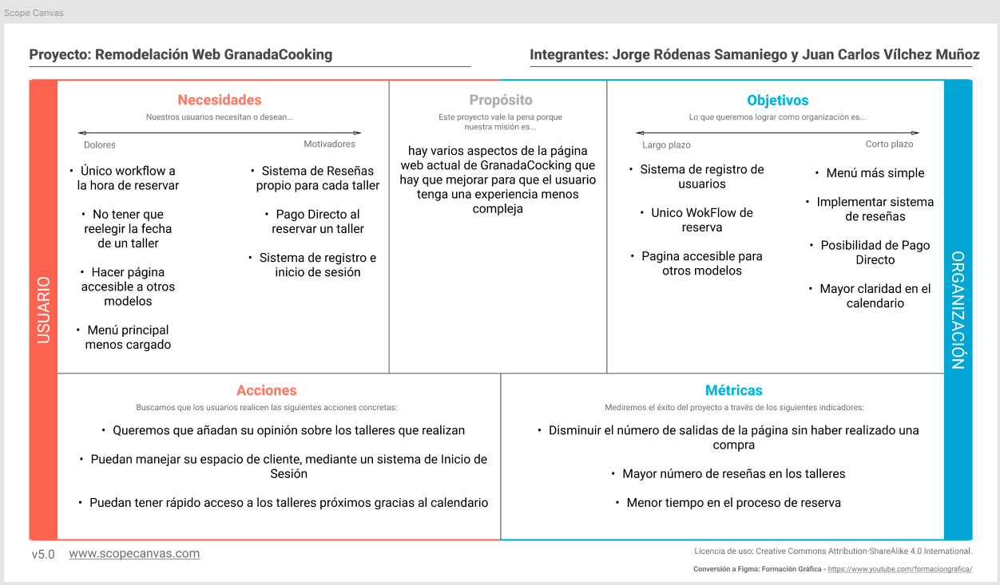
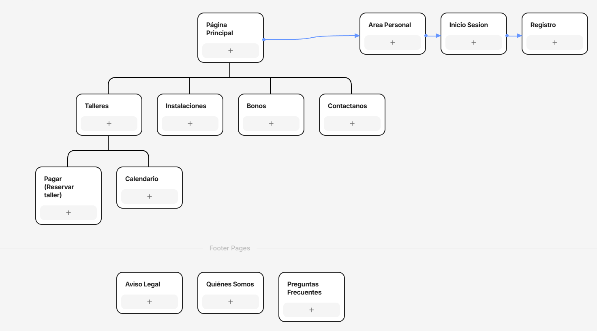

## DIU - Practica2, entregables

### Ideación 
* Malla receptora de información 

### PROPUESTA DE VALOR
* ScopeCanvas
* 

### TASK ANALYSIS

* User Task Matrix 
* User/Task flow

### ARQUITECTURA DE INFORMACIÓN

* Sitemap

  
* Labelling 

### Prototipo Lo-FI Wireframe 

### Conclusiones  
(incluye valoración de esta etapa)

>>>> Este fichero se debe editar para que cada evidencia quede enlazada con el recurso subido a la carpeta de la practica. Se pide más detalle técnico en las descripciones de lo que sería el README principal del repositorio y que corresponde a la descripcion del Case Study.
>>>> Termine con la seccion de Conclusiones para aportar una valoración final del equipo sobre la propia realización de la práctica
>>>>
>>>> Auntes Prácticas 2:
>>>> Podemos rediseñar por completo una página web o tomar una (GranadaCooking) y aplicarle cambios
>>>> 
>>>> Sin llegar a ser un modelo de negocio (no meterse en temas economicos), interesa el QUE ofertamos y COMO lo sabemos vender/explicar
>>>> 
>>>> ScopeCanva --> Que cosas quieres que haga el usuario y como lo vamos a medir
>>>>
>>>> Realizar MiniArquitectura de Informacion, como la organizamos, presentamos, etc
>>>> 
>>>> Acabaremos con un prototipo de página web (primer boceto de prototipo, donde plasmar las ideas iniciales)
>>>> 
>>>> Tarea Clave --> QUE vamos a hacer que merezca la pena (Estamos mejorando algo de lo que ya teniamos??)
>>>> 
>>>> Tener en cuenta que los usuarios creados "van a tener opinion" sobre lo que hacemos
>>>> 
