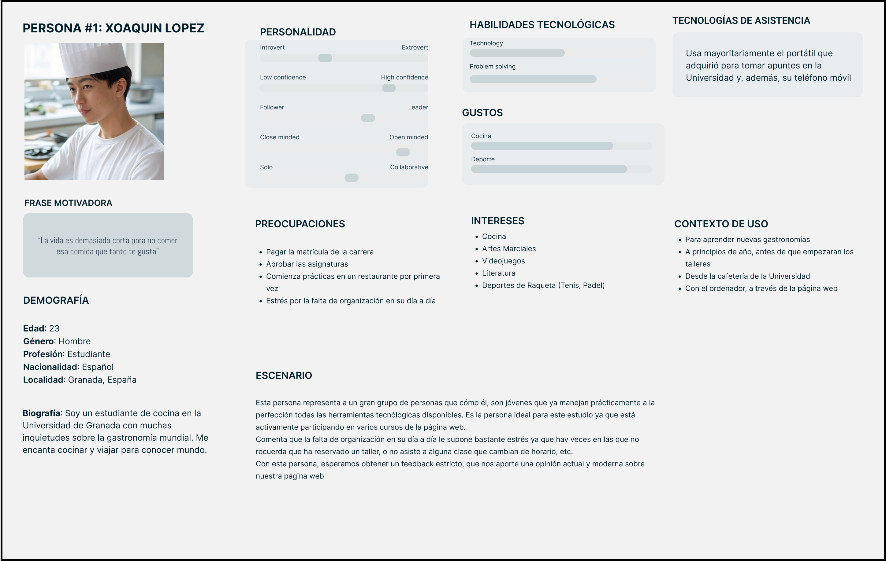
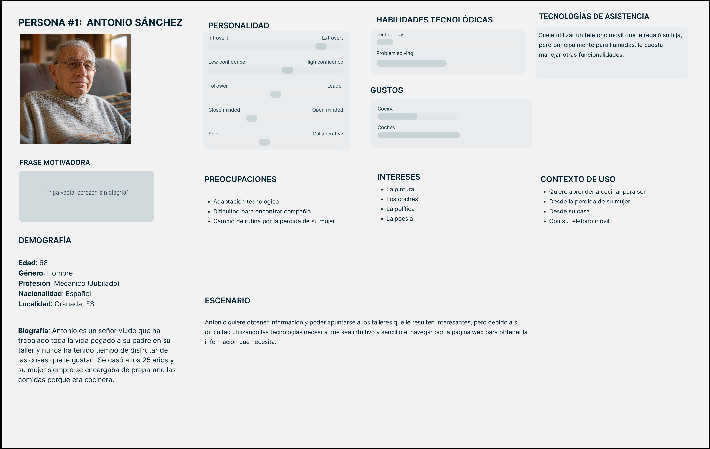
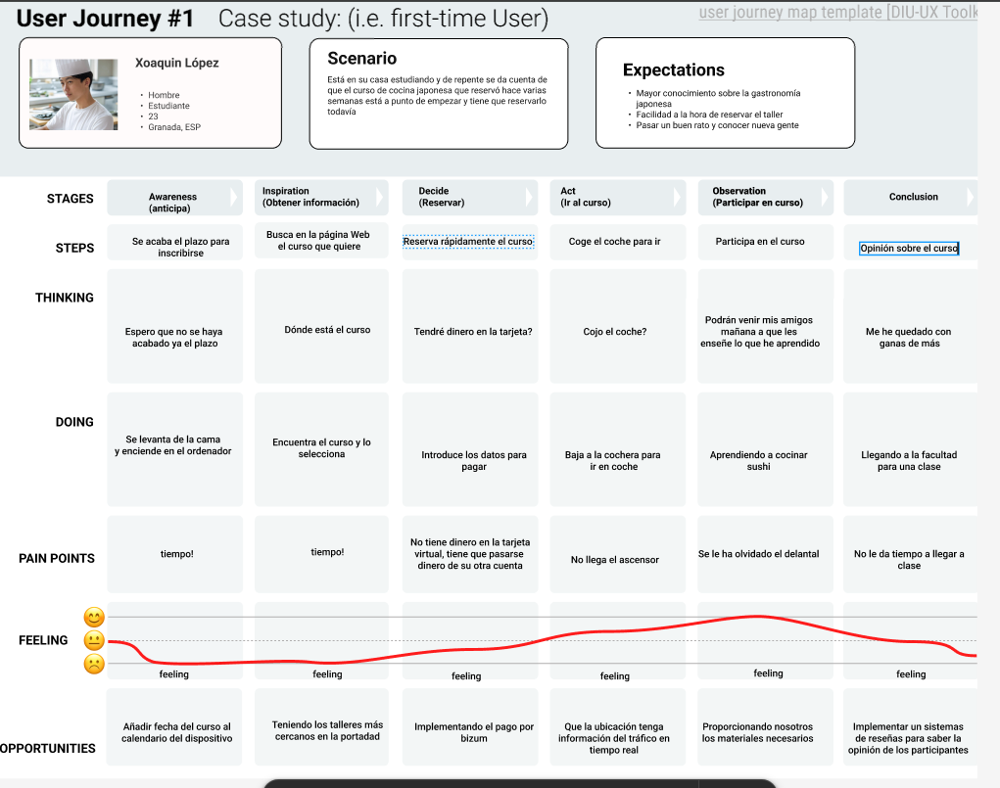
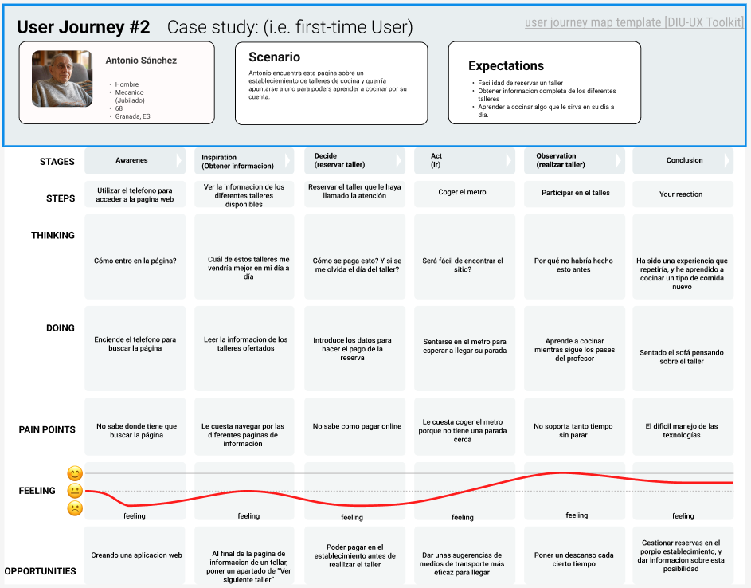

# DIU25
Prácticas Diseño Interfaces de Usuario (Tema: .... ) 

[Guiones de prácticas](GuionesPracticas/)

Grupo: DIU2_JCJ.  Curso: 2024/25 

Actualizado: 18/05/2025

Proyecto: 

GranadaCooking

Descripción: 

GranadaCooking es un espacio creativo y multicultural donde personas de todas partes pueden aprender a cocinar recetas del mundo en talleres presenciales, accesibles y divertidos, guiados por chefs apasionados en el corazón de Granada.

Logotipo: 

>>> Si diseña un logotipo para su producto en la práctica 3 pongalo aqui, a un tamaño adecuado. Si diseña un slogan añadalo aquí

Miembros:
 * :bust_in_silhouette:  Jorge Ródenas Samaniego     :octocat:    https://github.com/JorgeRodenas  
 * :bust_in_silhouette:  Juan Carlos Vílchez Muñoz     :octocat:    https://github.com/vikho22

----- 
# Proceso de Diseño 

 

## Paso 1. UX User & Desk Research & Analisis 

### 1.a User Reseach Plan
 
-----

Partiendo de una experiencia nula en este campo, y habiendo investigado en diferentes artículos relacionados al tema, podríamos abordar la investigación mediante entrevistas a diferentes personas que podría estar interesadas en acudir al establecimiento para poder comprender por qué los usuarios hacen lo que hacen, mediante las cuales podríamos obtener información de cuáles son las necesidades y preferencias de los usuarios, para poder poner en práctica algunas de estas y encontrar posibles fallos o dificultades en el diseño con el fin de conseguir una experiencia más sencilla para el usuario. También podríamos hacer una prueba con un número reducido de usuarios sobre un diseño, para estudiar las preferencias y la facilidad de uso de los usuarios, con el fin de hacer un diseño más simple y eficaz. 

Una vez rediseñado el modelo con los datos obtenidos en el estudio, volveríamos a hacer una prueba del diseño con otro grupo de usuarios para matizar los fallos y dificultades que puedan persistir.
  
### 1.b Competitive Analysis
 
-----
- Gestion de usuarios
- Información sobre la ubicación
- Soporte y asistencia
- Calendario de eventos
- Precios

Hemos escogido la gestión de usuarios como característica a evaluar, porque consideramos importante que el usuario pueda tener la comodidad de poder gestionar las reservas de manera sencilla.

### 1.c Personas
 
-----
Xoaquin López es un estudiante de Cocina en la Universidad de Granada que activamente participa en cursos que proporciona nuestra página web.
Es un modelo ideal para que nos aporte una versión moderna y actualizada sobre la página web.

Antonio Sánchez es un señor de 68 viudo que quiere aprender a cocinar para poder ser más autosuficiente después de la perdida de su mujer.
Es un modelo ideal ya que nos puede servir para extender la página web a todo tipo de públicos.

### 1.d User Journey Map
 
----
En este Journey Map, Xoaquin reserva al límite uno de los cursos de la web y además al llegar se da cuenta de que se ha olvidado parte del material necesario.

En este Journey Map se representan las dificultades que puede tener una persona de edad avanzada para utilizar la tecnologia con el fin de hacer una reserva.

### 1.e Usability Review
 
----

Valoración final Obtenida: 77 puntos

#### Briefing
Tras un estudio sobre la página web “GranadaCooking.com”, hemos detectado que es una página muy completa, con multitud de opciones que facilitan la experiencia del usuario. Entre estas opciones destacan el sistema de reservas y el calendario interactivo, que informa a los usuarios sobre los talleres más próximos. Además, cuenta con un sistema de preguntas frecuentes (FAQ) para resolver dudas sobre el funcionamiento del sitio y proporciona información precisa sobre la ubicación del lugar en la parte inferior de la página.
En cuanto a la navegación, es bastante intuitiva, ya que en todo momento indica en qué submenú te encuentras y dispone de una interfaz clara que permite a todo tipo de usuarios manejarse correctamente.
Sin embargo, el sistema de búsqueda no es muy intuitivo y podría mejorarse para ofrecer una mejor experiencia de navegación. También sería beneficioso implementar un sistema de retroalimentación (feedback) donde los usuarios que han realizado alguno de los cursos puedan dar su opinión y sugerir mejoras.

 

## Paso 2. UX Design  

### 2.a Reframing / IDEACION: Feedback Capture Grid / EMpathy map 
 
----

Como problema principal, observamos que falta un espacio donde el cliente pueda manerar sus reservas y ver con claridad los talleres
disponibles próximamente (en la página principal aparecen talleres ya finalizados). Para ello, plantearemos una propuesta más clara y
sencilla para asegurar una buena experencia del usuario a la hora de usar la página web

### 2.b ScopeCanvas

----

### 2.b User Flow (task) analysis 
 
-----

Hemos añadido las opciones principales que queremos que un usuario realice al entrar en la página.
Estas son la consulta de talleres futuros, los cuales podrán reservar de manera sencilla.
La otra tarea es la registro/inicio sesión, mediante la cual el usuario podrá ver sus reservas.

### 2.c IA: Sitemap + Labelling 
 
----

Hemos creado un SiteMap sencillo, que permita a los usuarios ver con claridad los aspectos más importantes que ofrecemos como empresa 
de talleres de cocina. Con respecto al modelo inicial, hemos reducido los apartados de la página principal, y además, hemos introducido
un apartado donde el cliente pueda registrarse y manejar sus reservas/bonos.

### 2.d Wireframes
 
-----

## Paso 3. Mi UX-Case Study (diseño)

### 3.a Moodboard

-----
En este moodboard para el proyecto GranadaCooking hemos definido la base conceptual y visual de una experiencia gastronómica que combina cocina tradicional con turismo cultural en la ciudad de Granada. El objetivo ha sido plasmar la esencia del proyecto a través de distintos elementos que ayuden a construir una identidad sólida y coherente. En primer lugar, se estableció el concepto general de la marca, enfocada en ofrecer vivencias auténticas que conectan a los participantes con la cultura local mediante la cocina. A nivel visual, se seleccionó una paleta de colores cálidos (como terracotas, beige y rojos profundos) que evocan lo acogedor y lo tradicional. Además, trabajamos el mensaje comunicativo de la marca, sintetizado en el eslogan "Cocinar con alma, saborear Granada", el cual transmite la intención emocional del proyecto. También identificamos a los públicos principales: personas apasionadas por la cocina y turistas culturales que buscan experiencias auténticas y locales. Finalmente, se incorporaron imágenes e inspiración visual que refuerzan la idea de comunidad, calidez y conexión con los ingredientes y el territorio. 

### 3.b Landing Page
 
----
Nuestra Landing Page busca captar la atención de usuarios interesados en experiencias culinarias únicas, destacando la oferta de talleres internacionales. El objetivo principal es generar interés y motivar a los usuarios a participar en las actividades que ofrece GranadaCooking, ya sea accediendo a la página web/app móvil o apuntándose a un taller.
 

### 3.c Guidelines
 
----

Tras buscar información sobre los UI Patterns, hemos decidido usar los siguientes patrones de diseño:
- Navegación y Contenido:
  -   Barra Navegación Fija: Navegación simple sin sobrecargar y accesible en todo tipo de dispositivos
  -   Carrusel + Hero Image: Reusando lo que ya tenía Granada Cooking para destacar visualmente los aspectos importantes
  -   Sistema de Búqueda: Permite encontrar con facilidad los talleres según sus preferencias

- Interacción y Acciones de Usuario:
  -   Reserva: Sistema que facilita la reserva de cursos y compra de bonos
  -   Calendario: Usamos un calendario para indicar los próximos talleres
  -   Card Layout: Para mostrar visualmente los distintos talleres de cocina

- Comunicación y Retroalimentación:
  -   Mensajes de Confirmación: Para que el usuario esté siempre consciente de su estado en la aplicación
  -   About: Proporcionamos información sobre la empresa y su modelo de negocio
  -   Sistema de Reseñas: Permitimos insertar reseñas para 

### 3.d Mockup
 
----

Como parte del mockup, hemos realizado el diseño hi-fi de nuestra app (realizado para el modelo iPhone 16 Pro Max). 
Que empieza en un pantalla de carga, que al pulsar accede a la página de Inicio de nuestra aplicación. En esta página ya se ven los distintos talleres y el menú inferior presenta las distintas funcionalidades de nuestra app.
[En este link](https://www.figma.com/proto/oNh4vmsAwtUuVXM1IU2WrM/Breakpoints--Community-?node-id=72-2222&p=f&t=wLKWuAV82ODS6u5k-0&scaling=scale-down&content-scaling=fixed&page-id=35%3A114&starting-point-node-id=72%3A2222) se puede observar el prototipo general.

### 3.e ¿My UX-Case Study?
 
-----

 

## Paso 4. Pruebas de Evaluación 

### 4.a Reclutamiento de usuarios 

-----

El caso que se nos ha asignado es el de nuestros compañeros de [Pizza Con Curry](https://github.com/DIU3-Pizza-con-Curry/UX_CaseStudy). Su proyecto consiste en una aplicación centrada en el reciclado y reutilización de prendas de ropa.
Permiten que los usuarios suban sus creaciones, y que el resto de usuarios de la aplicación puedan consultarlas y valorarlas.

| Usuarios | Sexo/Edad     | Ocupación   |  Exp.TIC    | Personalidad | Plataforma | Caso
| ------------- | -------- | ----------- | ----------- | -----------  | ---------- | ----
| Germán  | H / 21   | Estudiante  | Avanzada      | Extrovertido | Windows      | A 
| Isaac  | H / 26   | Estudiante  | Avanzada      | Extrovertido       | Web        | A 
| Julián  | H / 21  | Estudiante     | Avanzada        | Emocional    | Windows    | B 
| Pepelu  | H / 18   | Estudiante  | Avanzada        | Racional     | Web        | B 

### 4.b Diseño de las pruebas 
 
-----
Para este apartado, hemos usado la herramienta Maze (proporcionada por el profesor), en la que hemos incluido un primer apartado con preguntas orientadas a conocer los gustos/preferencias del usuario y un segundo bloque donde hemos preparado para que los usuarios realicen varias tareas dentro de los proyectos a estudiar.
En nuestro caso, las tareas son "Realizar Registro" y "Reservar un nuevo Taller" y por otro lado, para el otro proyecto son "Realizar una publicación" y "Dar me gusta a una publicación".

### 4.c Cuestionario SUS
 
----

>>> Como uno de los test para la prueba A/B testing, usaremos el **Cuestionario SUS** que permite valorar la satisfacción de cada usuario con el diseño utilizado (casos A o B). Para calcular la valoración numérica y la etiqueta linguistica resultante usamos la [hoja de cálculo](https://github.com/mgea/DIU19/blob/master/Cuestionario%20SUS%20DIU.xlsx). 
>>> Adjuntar en la carpeta P4/ el excel resultante y describa aquí la valoración personal de los resultados 

### 4.d A/B Testing
 
-----

>>> Los resultados de un A/B testing con 3 pruebas y 2 casos o alternativas daría como resultado una tabla de 3 filas y 2 columnas, además de un resultado agregado global. Especifique con claridad el resultado: qué caso es más usable, A o B?

### 4.f Usability Report de B
 
-----

En general, la página es fácil de usar, bastante clara y sencilla. Al ser una página sobre un tema muy específico, el número de usuarios es reducido, pero para los que sí se interesen en este tema tendrán una buena experiencia en general.

Como puntos negativos podríamos destacar que carece de un sistema de registro e inicio de sesión, lo cual podría ser beneficioso para aquellos que quieran publicar varios artículos y gestionarlos, en vez de introducir sus datos personales cada vez que quiera realizar un post. Además, el menú lateral se ve pobre, incluyendo solo la opción para filtrar el orden en el que aparecen las publicaciones y el contador.

El uso de este tipo de cuestionario nos ha parecido bastante interesante y a la postre representativo para obtener una “calificación” final sobre un sitio web. Nos ha permitido entender los gustos y necesidades de los usuarios implicados para intentar mejorar los sistemas que hemos estudiado, tanto el nuestro como el de nuestros compañeros del grupo Pizza-con-curry.

El resto del Usability Report se encuentra en el siguiente 

 

## Conclusiones finales & Valoración de las prácticas

>>> Opinión FINAL del proceso de desarrollo de diseño siguiendo metodología UX y valoración (positiva /negativa) de los resultados obtenidos. ¿Qué se puede mejorar? Recuerda que este tipo de texto se debe eliminar del template que se os proporciona 

